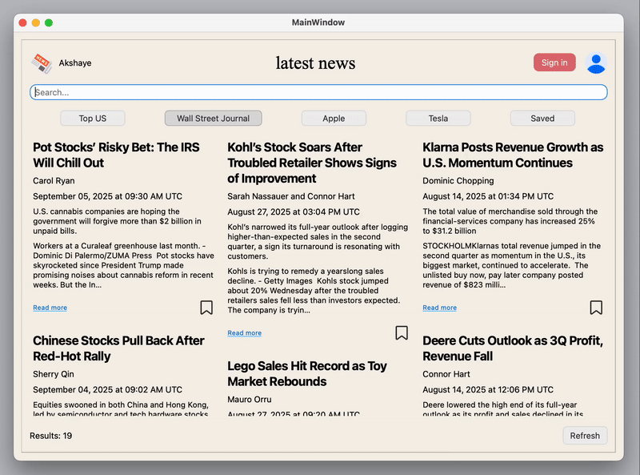

# News Aggregator

A desktop application built using `PyQt` that fetches and displays the latest news articles from [NewsAPI.org](newsapi.org).

The app lets you browse headlines from different sources and topics such as **Top US News**, **Tesla**, **Apple**, **Wall Street Journal**. You can save articles to your account for later reading, update your profile information, and enjoy a clean, responsive interface designed with Qt Designer. Enter your news api key once to use this app.

## Features

* Browse news articles based on categories/topics.
* Search for custom keywords to fetch articles on any topic of interest.
* Refresh articles to get the latest information.
* Save and unsave up to 6 articles per account for quick access later.
* Clean `PyQt5` interface designed with `Qt designer`.
* Links to source websites for full articles.

## Demo



## Requirements

* Python 3.9+
* `PyQt5`
* Requests
* A news API key ([Available here](newsapi.org))

## Getting Started

When you run the app for the first time, you’ll be asked to enter your NewsAPI key.
You only need to do this once — the key is stored locally so you won’t need to re-enter it on future runs.

## Setup

1. Clone the repository:
```bash
git clone https://github.com/Akshaye-Sharma/news-aggregator
cd news-aggregator
```
2. Install dependencies:
```bash
pip install -r requirements.txt
```
3. Run the application
```bash
python main.py
```
For Mac:
```bash
python3 main.py
```
## Project Structure
```bash
├── main.py               # Start the application
├── views/
│   └── main_window.py    # Window logic handler
│   └── sign_in.py    
│   └── key_entry.py      # Key entry start up handler
│   └── profile.py        
├── api/
│   └── api_params.py    
│   └── api_request.py    
├── ui/
│   └── ui_mainwindow.py  # PyQt generated file
│   └── ui_mainwindow.ui
├── icons/                # Images used
│   └── speaker.png
│   └── user.png
│   └── ...
├── config_manager.py
├── load_db.py
├── .gitignore
├── requirements.txt
└── README.md
```